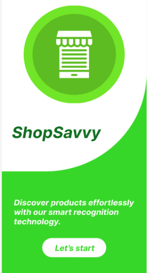
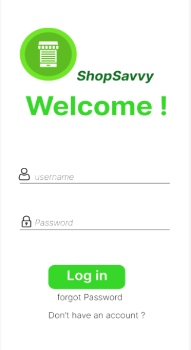
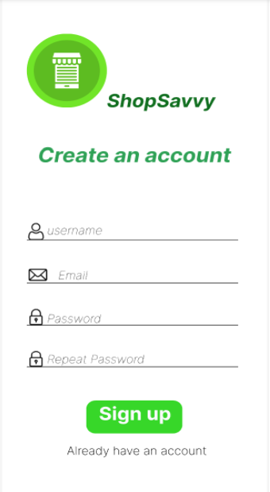

<h3 align="center" color="#C70608">  Application Web de Reconnaissance de Produits </h3>

ShopSavvy : l'objectif de ce projet est de concevoir et développer une application web intelligente offrant aux utilisateurs la possibilité de reconnaître aisément des produits spécifiques lors de leurs achats.L'application utilisera la technologie de reconnaissance d'images ou scanne d’un code-barres pour offrir une expérience utilisateur intuitive et efficace. Grâce à ces technologies innovantes, les utilisateurs pourront identifier rapidement et précisément les produits qui les intéressent. 

<h3 align="left"  color="#C70608">Objectifs :</h3>
<ul>
  <li> Développer une interface conviviale et intuitive pour les utilisateurs finaux.</li>
  <li>Permettre aux utilisateurs de créer des comptes personnels.</i>
  <li>Intégrer la technologie de reconnaissance des codes barres pour permettre aux utilisateurs d'identifier les produits à l'aide de photos ou de codes-barres.</li>
  <li>Créer une base de données de produits complète et maintenue à jour. </li>
  <li>Les utilisateurs auront la possibilité d'ajouter de nouveaux éléments à la base de données de produits.</li>
  <li>Les produits ajoutés par les utilisateurs doivent être soumis à une validation par l'administrateur avant d'être approuvés et ajoutés à la base de données.</li>
  <li>Maintenir un historique des validations des produits, y compris les détails de l'utilisateur ayant soumis le produit, la date de soumission, la décision de validation de l'administrateur. </li>
</ul>
  Le prototype : 

          https://www.figma.com/file/PvlRLamSolWNizZN018rDV/Untitled?type=design&node-id=38%3A11&mode=design&t=0MklWeVcyTWKXAHG-1

    
    
    

